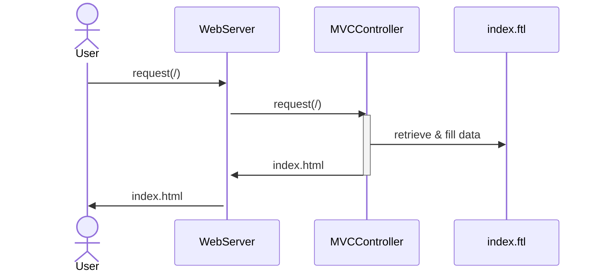

# MVC Example
This project is based on [Josh Long's short review of Spring MVC](https://www.youtube.com/watch?v=hUBrFekxn0Y).

The main difference in this project is that we use [Apache Freemarker](https://freemarker.apache.org) instead of Thymeleaf.

## Project Overview
This project consists of a single [webpage](./src/main/resources/templates/index.ftl) that uses Freemarker template engine constructs to render dynamic data. The [MVCController](./src/main/java/com/example/mvc/MVCController.java) maps URL requests and methods that represent the expected behaviour - like retrieving a webpage. In addition, [MVCExceptionHandler](./src/main/java/com/example/mvc/MVCExceptionHandler.java) is used to concentrate error handling in one single place.

The sequence diagram below shows a simplistic overview of a typical success case.

> Please notice that the goal is not to be technically accurate, but to give an idea of the overall process. There are many more things happening here, like the template engine and the Spring Framework interactions.



The `MVCController` class is annotated with `org.springframework.stereotype.Controller`, representing a controller in the MVC pattern. The snippet below shows the class methods.

```java
@GetMapping("/")
public String init() {
	return "/index";
}

@PostMapping("/")
public String init(@RequestParam String name, Model model) {
	
	if (Character.isLowerCase(name.charAt(0))) {
		throw new RuntimeException("A name must start with a capital letter");
	}

	model.addAttribute("username", name);

	return "/index";
}
```

`org.springframework.web.bind.annotation.GetMapping` and `org.springframework.web.bind.annotation.PostMapping` map the URL and the HTTP method with a particular Java method. Notice the method overload. Whereas the first method has no parameter, the second has two parameters. 

The second method waits a parameter `name` from the webpage form. It also add a value to the `org.springframework.ui.Model` object. This object is injected by the framework and the webpage uses it to render the name previously informed.

In case of an exception, the `MVCExceptionHandler` class is activated. The annotation `org.springframework.web.bind.annotation.ControllerAdvice` is responsible for that. The method `handleException` handles the exception. 